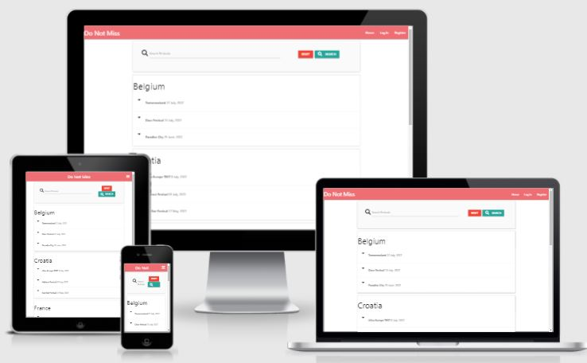
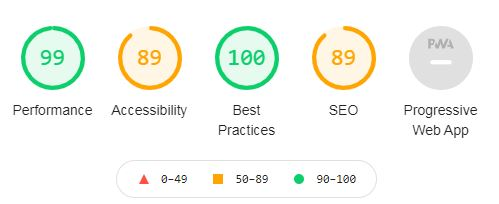

# DoNotMiss



[Visit site here](https://do-not-miss.herokuapp.com/)


This website offers basic information about the main EDM festivals around the globe such as the location, dates and artists. It aims to be a guide to all Electronic Dance Music fans who are in search of the main events in the world.
This website is mobile-first design and it's fully responsive and accessible on a vast range of devices, making it easy to navigate for all kinds of users.
 
## User Experience (UX)

### Strategy Plane
#### Target audience for EDMfestivalsEU:

- Users aged 16-40, given the fact that Electronic Dance Music is more extensive between this age range.
- Users interested in Electronic Dance Music.
- Users interested in music events, specially big festivals.
- Users interested in planning their vacation or weekend getaway around a music festival in Europe.
- Users interested in finding information about an specific festival.


#### Business Goals

Allow users to find the best EDM festivals in Europe.
Present the website on a user-friendly form, where information can be absorbed easily.
Help the user understand the information displayed within the first visit to the website.
Allow users to find and add any festivals to the database.
Allow admin to edit and delete information from the database.

#### User stories 
- ##### As a First Time Visitor, I want to...
    - Easily understand the content in order to find the information I'm looking for.
    - Easily navigate and find content through the website in an user-friendly way.
    - Find visual resources that support and complement the content.

- ##### As a Returning Visitor, I want to...
    - Find the familiar interface and layout which I already experienced.


### Scope Plane

Minimal Viable Product for this project is a website with at least the below features;

- Navigation Bar on desktop and tablet screen, hamburger on mobile.
- Interactivity unfolding the list of festivals for each country.
- Ability to perform CRUD in the database.

### Structure Plane
- The user can navigate through the different sections of the page
using a navigation bar on desktop and tablet screen versions.
- The user can navigate through the different sections of the page
using a hamburger on mobile screen versions.

### Skeleton Plane
- Screen
    - 

### Surface Plane
This website aims to give information about festivals
The focus has been in the connection with the databse more than with the design itself.


### Existing Features
- Responsive on all devices: allows the user to navigate comfortably on the page regardless of the device type used.
- Navigation Bar and hamburger: allows the user to navigate through the web sections and pages with ease.
- Add, edit and delete buttons, as well as search tab, allows user to perform CRUD actions


## Technologies Used
### Languages
- HTML5
- CSS3
- Javascript
- Python
- MongoDB

### Frameworks, Libraries & Programs Used
- [Github](https://github.com/): used to store the projects code.
- [Gitpod](https://gitpod.io/workspaces): used for version control.
- [Materialize 1.0.0](https://materializecss.com/about.html): used to assist with the responsiveness and styling of the website.
- [Balsamiq](https://balsamiq.com/): used for wireframe design.
- [jQuery v3.5.1](https://jquery.com/): used to implement interactivity on the page.
- [Flask](https://flask.palletsprojects.com/en/2.0.x/): used for the development of the app.


## Testing
### W3C Markup Validator and W3C CSS Validator
- W3C Markup Validator
- W3C CSS Validator
- Jshint JavaScript Validator

### Lighthouse Chrome Developer Tools


### Testing User Stories
##### As a First Time Visitor, I want to...
- Easily understand the content in order to find the information I'm looking for.
    - Webpage is well structured and sections are presented clearly to the user.
- Easily navigate and find content through the website in an user-friendly way.
    - Navigation bar allows user to move through different sections of the website.

##### As a Returning Visitor, I want to...
- Find the familiar interface and layout which I already experienced.
    - Layout is easy to understand, user friendly and intuitive.

### Further testing
- The Website has been tested in all different screen devices from Google Developer Tools.
- The Website has been viewed on a variety of devices and screen sizes.
- The Website has been tested on Google Chrome, Internet Explorer, Safari and Microsoft Edge.
- All links have been tested
- Interactivity has been tested.
- Communication with the database has been tested for all CRUD functionalities.

### Fixed bugs
Many bugs were encountered on the way. The majority of them were fixed with the help of the Slack Code Institute community and Stack Overflow community. Some of the most challenging bugs were:
- The updated method was not accepted. I fixed it by using the update_one method and passing through {'$set': submit}).
- The list of festivals would not show after adding the search bar functionality. I converted the festival variable into a list.

## Deployment
### GitHub Pages

The project was deployed to GitHub Pages using the following steps...

1. Log in to GitHub and locate the [GitHub Repository](https://github.com/marctell92/do-not-miss)
2. At the top of the Repository (not top of page), locate the "Settings" Button on the menu.
3. Scroll down the Settings page until you locate the "GitHub Pages" Section.
4. Under "Source", click the dropdown called "None" and select "Master Branch".
5. The page will automatically refresh.
6. Scroll back down through the page to locate the now published site [link](https://marctell92.github.io/do-not-miss) in the "GitHub Pages" section.

### Forking the GitHub Repository

By forking the GitHub Repository we make a copy of the original repository on our GitHub account to view and/or make changes without affecting the original repository by using the following steps...

1. Log in to GitHub and locate the [GitHub Repository](https://github.com/marctell92/do-not-miss)
2. At the top of the Repository (not top of page) just above the "Settings" Button on the menu, locate the "Fork" Button.
3. You should now have a copy of the original repository in your GitHub account.

### Making a Local Clone

1. Log in to GitHub and locate the [GitHub Repository](https://github.com/marctell92/do-not-miss)
2. Under the repository name, click "Clone or download".
3. To clone the repository using HTTPS, under "Clone with HTTPS", copy the link.
4. Open Git Bash
5. Change the current working directory to the location where you want the cloned directory to be made.
6. Type `git clone`, and then paste the URL you copied in Step 3.

```
$ git clone https://github.com/marctell92/do-not-miss
```

7. Press Enter. Your local clone will be created.

```
$ git clone https://github.com/marctell92/do-not-miss
> Cloning into `CI-Clone`...
> remote: Counting objects: 10, done.
> remote: Compressing objects: 100% (8/8), done.
> remove: Total 10 (delta 1), reused 10 (delta 1)
> Unpacking objects: 100% (10/10), done.
```

## Credits
- All code has strong inspiration from all learning material given by Code Institute, specially the Task Manager Project.
- Multiple pieces of code have been taken from Materialize Library and modified to fit the design needs.

### Content
- README.md was strongly inspired by the Sample README from user lechien73 on GitHub, sample given by the Code Institute Mentor Team.
- Deployment section of the README.md was copied from the above mentioned Sample README.

### Media
- All images were obtained via Google Images, using the Usage Rights tools to make sure all of them had Creative Commons licenses.

### Acknowledgements
- Code Institue Tutor Support and Mentor Team. 